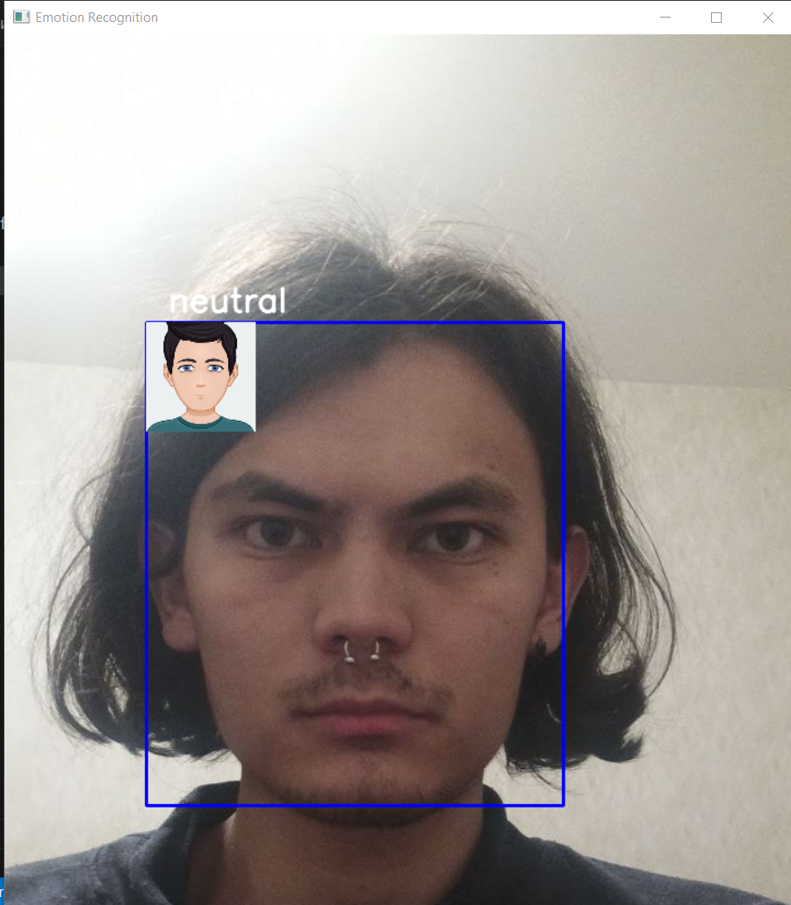
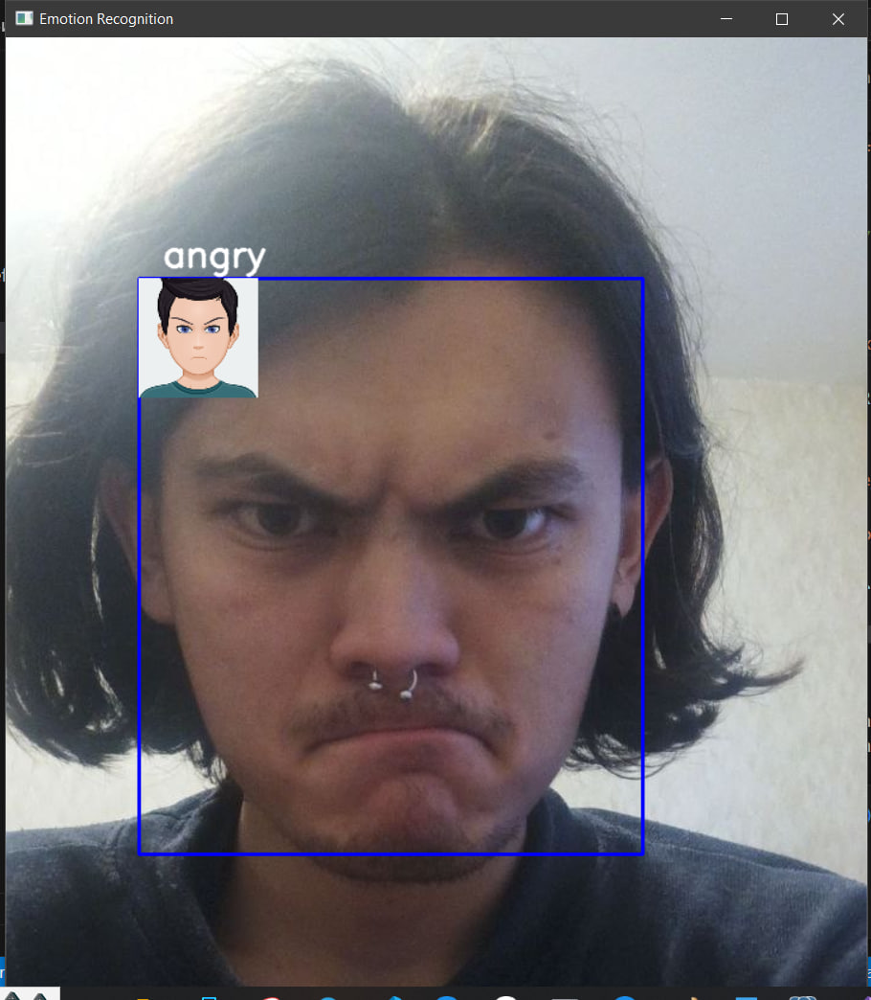
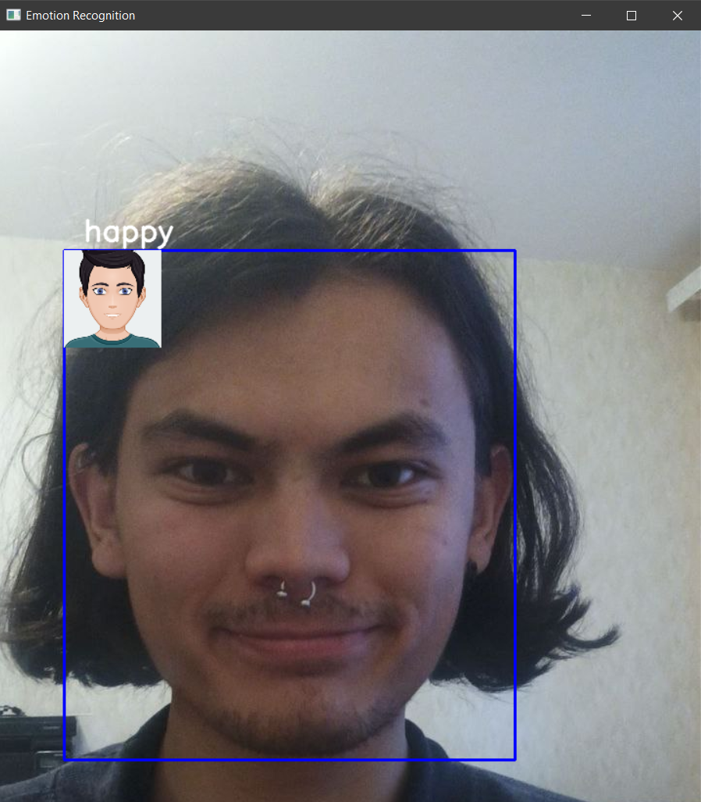

# Эмоциональное распознавание с использованием нейронной сети

## 1. Подготовка данных
- **Директории**:
  - train_dir: Путь к тренировочным данным.
  - val_dir: Путь к валидационным данным.
  
- **Генерация данных**:
  - Используем ImageDataGenerator для нормализации изображений.

## 2. Создание модели
- **Архитектура**:
  - Сеть состоит из нескольких сверточных слоев, слоев подвыборки и полносвязного слоя.
  - Используются функции активации ReLU и softmax для классификации.

## 3. Обучение модели
- **Проверка наличия весов**:
  - Если файл с весами существует, обучение пропускается.
  - В противном случае модель обучается на тренировочных данных и сохраняет веса.

## 4. Обработка изображения
- **Загрузка и преобразование**:
  - Загружается изображение и преобразуется в оттенки серого.
  
- **Обнаружение лиц**:
  - Используется каскадный классификатор для нахождения лиц на изображении.

## 5. Предсказание эмоций
- **Классификация**:
  - Для каждого обнаруженного лица предсказывается эмоция с помощью обученной модели.
  
- **Отображение результата**:
  - Рисуется прямоугольник вокруг лица и выводится текст с предсказанной эмоцией.

## 6. Наложение стикеров
- **Загрузка стикера**:
  - Загружается соответствующий стикер для предсказанной эмоции.

- **Расположение стикера**:
  - Стикер размещается над лицом, с проверкой границ изображения.

## 7.Тесты

## Заключение
Эта программа позволяет распознавать эмоции на изображениях и визуализировать результат с помощью стикеров, создавая интерактивный опыт.
